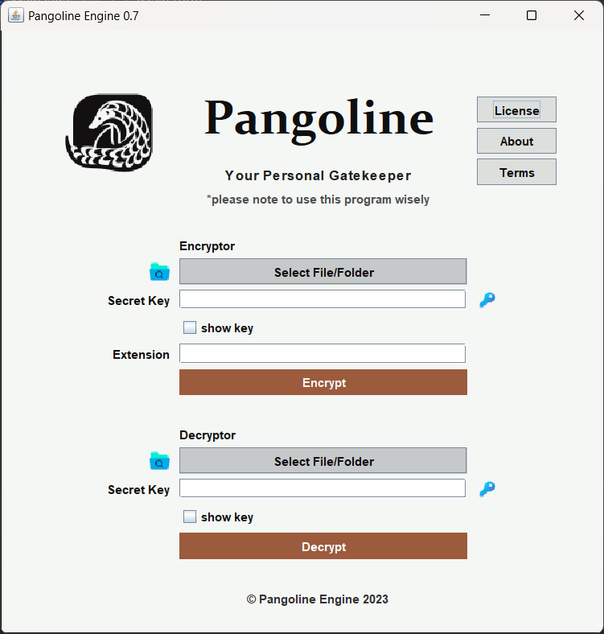

# Pangoline Engine 0.7 [BETA]

Pangoline Engine is a file encryption tool designed to secure files using the Advanced Encryption Standard (AES) algorithm. It provides a graphical user interface for easy file selection, encryption, and decryption processes.

## Features

- **File Encryption**: Encrypt individual files or entire folders using a user-provided secret key.
- **AES Encryption**: Utilizes AES encryption in ECB mode with PKCS5 padding for secure file encryption.
- **Decryption**: Allows decryption using the same secret key used for encryption.
- **User Interface**: Graphical user interface (GUI) for file selection, key entry, and access to information about the application.

## Getting Started

### Prerequisites

- Java Development Kit (JDK) installed on your system.

### How to Use

1. Clone this repository or download the source code.
2. Compile the code using a Java IDE or via the command line.
3. Run the compiled code to launch the Pangoline Engine GUI.
4. Select files or folders for encryption or decryption.
5. Enter the secret key and perform the encryption or decryption process.

## Usage Example

## Contributing

Contributions are welcome! If you have suggestions, feature requests, or found a bug, please open an issue or submit a pull request.

## License

This software is distributed under the GNU General Public License (GPL). See the [LICENSE](LICENSE) file for more details.

## About

Pangoline Engine is developed by Kelompok 2..

## Acknowledgments

- Mention any contributors or libraries used in the project.
- If applicable, give credits to any tutorials or resources that were helpful.

